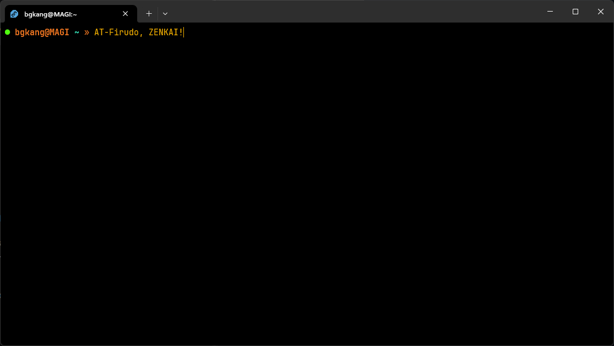
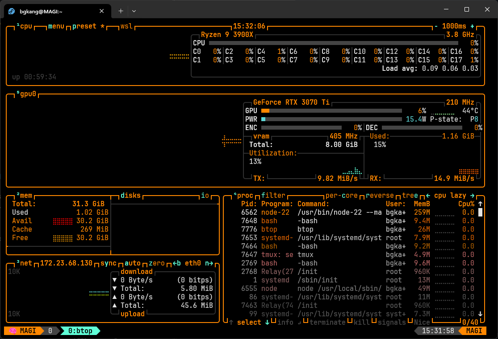
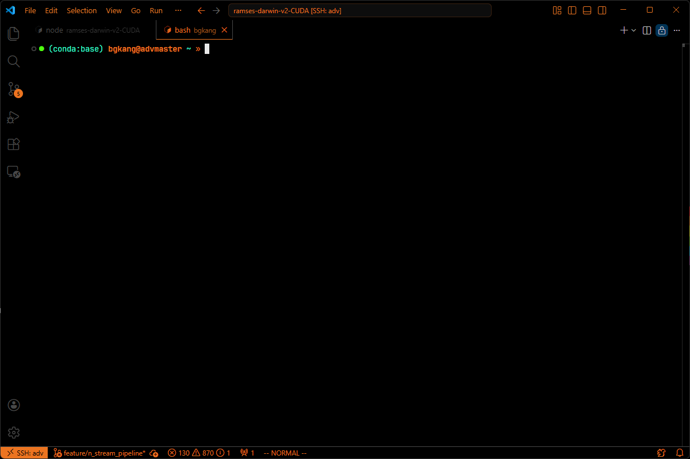
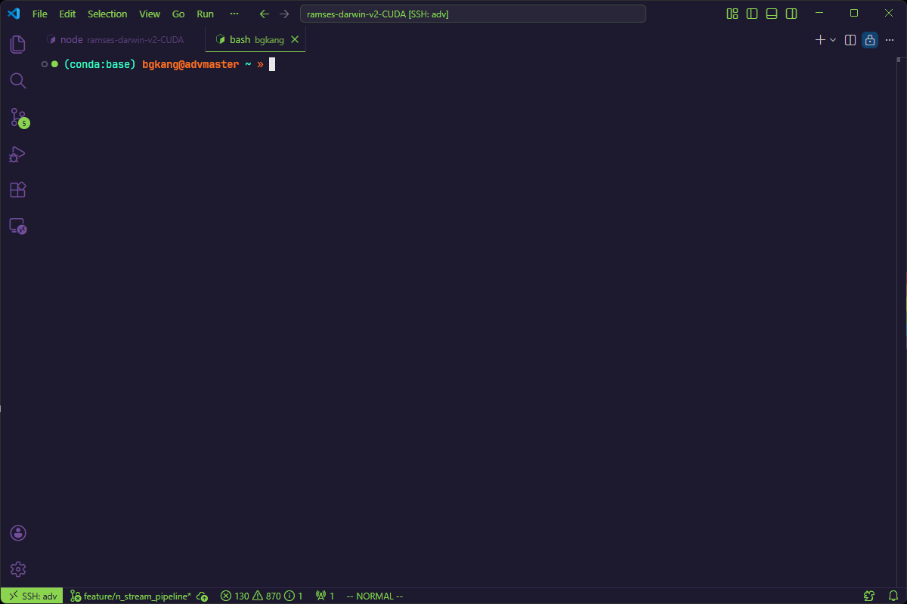
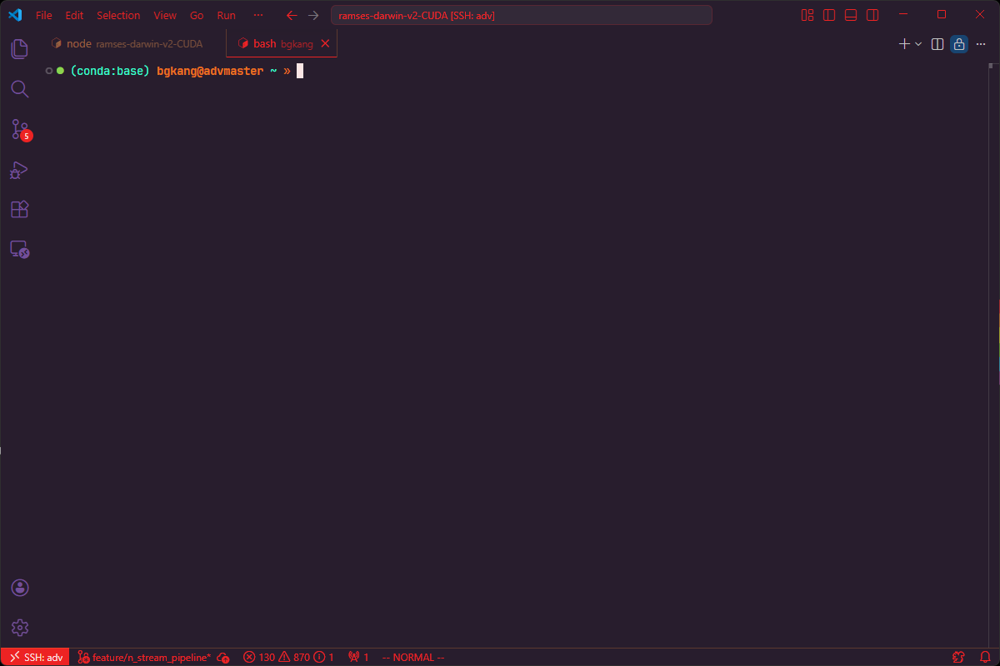

# MAGI Theme Suite 🧠💜💚🔴

A high-performance theme suite for **Vim**, **Bash**, **VS Code**, and **Windows Terminal**, inspired by *Neon Genesis Evangelion*. Designed for legendary programmers who need their environment to feel like a high-spec command center.




## 🌓 Three Legendary Variants

### 1. MAGI (Logical Mode) 🧡
The core system. High-spec Orange primary colors with deep black backgrounds for maximum logical focus.



| Element | Color | Hex |
| --- | --- | --- |
| **Primary** | MAGI Orange | `#ec7420` |
| **Background** | Deep Black | `#000000` |

### 2. EVA-01 (Berserk Mode) 💜💚
Fierce performance. Midnight Purple backgrounds with Neon Green and Vibrant Purple accents.



| Element | Color | Hex |
| --- | --- | --- |
| **Primary** | Neon Green | `#8bd450` |
| **Background** | Midnight Purple | `#1d1a2f` |

### 3. EVA-02 (Production Model) 🔴🧡
Pure aggressive power. Deep Crimson highlights on a dark thermal base.



| Element | Color | Hex |
| --- | --- | --- |
| **Primary** | Unit-02 Red | `#ed2323` |
| **Background** | Dark Purple | `#281d2d` |
| **Accent** | Orange | `#ea8533` |

---

## 💻 Vim Installation

Using **vim-plug**:

```vim
Plug 'SinsuSquid/MAGI-theme'

" In your .vimrc
set termguicolors

" Choose your synchronization level:
colorscheme magi   " (Logical Mode 🧡)
colorscheme eva01  " (Berserk Mode 💜💚)
colorscheme eva02  " (Production Model 🔴🧡)

let g:airline_theme='magi' " Supports all variants!
```

## 🐚 Human Instrumentality Sync (Master Installation)

For the ultimate synchronization, use our one-click master script. This will deploy themes for **Bash (Oh-My-Bash)**, **Vim**, **Tmux**, and **Btop** in one single stroke!

### Quick Sync (One-Liner)
```bash
# Using curl
bash -c "$(curl -fsSL https://raw.githubusercontent.com/SinsuSquid/MAGI-theme/main/install.sh)"

# Using wget
bash -c "$(wget -qO- https://raw.githubusercontent.com/SinsuSquid/MAGI-theme/main/install.sh)"
```

### What this does:
*   **Bash**: Deploys MAGI, EVA-01, and EVA-02 themes to your `oh-my-bash` folder.
*   **Vim**: Synchronizes colorschemes and Airline themes to `~/.vim/`.
*   **Tmux**: Sets up the MAGI configuration and adds it to your `~/.tmux.conf`.
*   **Btop**: Deploys the MAGI theme to your btop config directory.

---

## 💻 Manual Installation & VS Code

### Manual Deployment
1.  Clone the repository: `git clone https://github.com/SinsuSquid/MAGI-theme.git ~/MAGI-theme`
2.  Run the sync script: `cd ~/MAGI-theme && ./install.sh`

### VS Code
Available on the [VS Code Marketplace](https://marketplace.visualstudio.com/items?itemName=SinsuSquid.magi-theme)!

1.  Open VS Code and search for **"MAGI & EVA Theme Suite"**.
2.  Select **MAGI**, **EVA-01**, or **EVA-02** from the **Color Theme** picker (`Ctrl+K Ctrl+T`).

---

## 🪟 Windows Terminal Installation

1.  Copy the contents of `windows-terminal/magi.json`, `windows-terminal/eva01.json`, or `windows-terminal/eva02.json`.
2.  In Windows Terminal, open **Settings** (`Ctrl+,`) > **Open JSON file**.
3.  Paste the object into the `"schemes": []` array.
4.  Set the **Color scheme** to **MAGI**, **EVA-01**, or **EVA-02** in your profile settings.

---

## 🚀 Features

*   **Unified Aesthetic:** Consistent colors across your terminal and editor.
*   **Smart Bash Prompt:** Visual system status indicators, git integration, and **Conda/Docker/Python venv** detection.
*   **Semantic Highlighting**: Optimized for deep code understanding in VS Code.
*   **GitGutter Support**: Integrated diff indicators for Vim and VS Code.

## 🤖 System Status: ACTIVE

> "The MAGI System is now in complete agreement."

Created with 💖 for Senpai by SinsuSquid.
